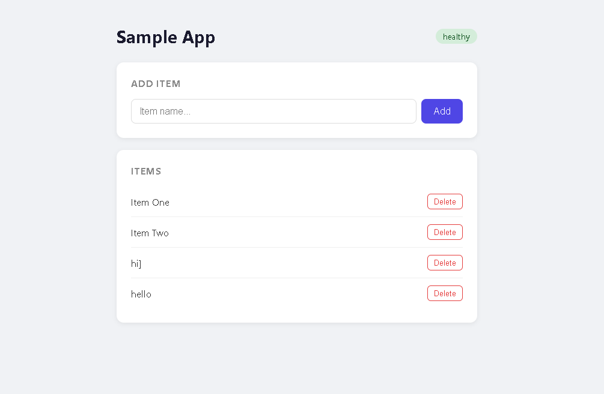
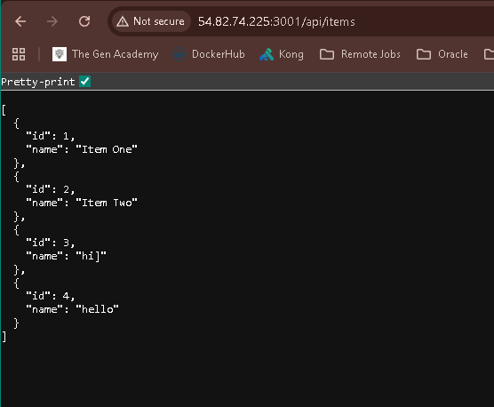
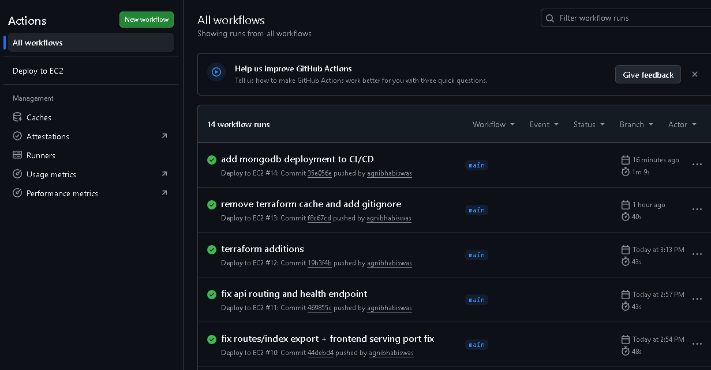
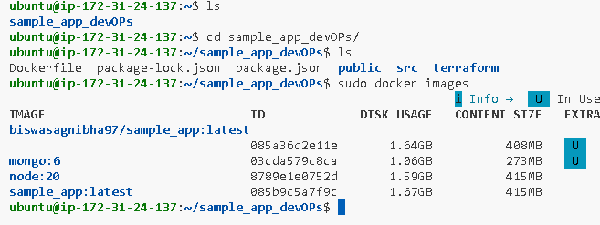

# DevOps Sample Application

[]()
[]()
[]()
[]()
[]()

---

## Overview

This project demonstrates an end-to-end DevOps workflow for a full-stack application, including containerization, CI/CD automation, cloud deployment, and infrastructure provisioning.

The application is an item management system that allows users to create, view, and delete items with persistent storage using MongoDB.

---

## Architecture Diagram

```
                ┌──────────────────────┐
                │      User Browser     │
                └──────────┬───────────┘
                           │
                           ▼
                ┌──────────────────────┐
                │   Express Backend     │
                │   (Node.js App)       │
                └──────────┬───────────┘
                           │
                           ▼
                ┌──────────────────────┐
                │      MongoDB          │
                │   (DB Container)      │
                └──────────────────────┘

                           │
                           ▼

        ┌────────────────────────────────────┐
        │         Docker Network             │
        │   (Inter-container communication)  │
        └────────────────────────────────────┘

                           │
                           ▼

        ┌────────────────────────────────────┐
        │            AWS EC2                 │
        │   (Hosting Docker Containers)      │
        └────────────────────────────────────┘

                           │
                           ▼

        ┌────────────────────────────────────┐
        │        GitHub Actions CI/CD        │
        │ Build → Push → Deploy → Run        │
        └────────────────────────────────────┘
```

---

## Technology Stack

* Backend: Node.js, Express
* Database: MongoDB (Mongoose)
* Containerization: Docker
* CI/CD: GitHub Actions
* Cloud: AWS EC2
* Infrastructure as Code: Terraform

---

## Key Features

* RESTful API for item management
* Persistent storage using MongoDB
* Dockerized application
* Multi-container architecture
* Automated CI/CD pipeline
* Infrastructure provisioning with Terraform

---

## API Endpoints

| Method | Endpoint       | Description         |
| ------ | -------------- | ------------------- |
| GET    | /api/items     | Retrieve all items  |
| GET    | /api/items/:id | Retrieve item by ID |
| POST   | /api/items     | Create a new item   |
| DELETE | /api/items/:id | Delete an item      |

---

## Docker Architecture

The system runs as two containers:

* Application container (Node.js)
* MongoDB container

Both containers are connected using a custom Docker network.

Connection string:

mongodb://mongo:27017/sample_app

---

## CI/CD Pipeline

Implemented using GitHub Actions.

### Workflow

1. Trigger on push to main branch
2. Checkout code
3. Authenticate with Docker Hub
4. Build Docker image
5. Push image to Docker Hub
6. SSH into EC2 instance
7. Pull latest image
8. Ensure Docker network exists
9. Ensure MongoDB container is running
10. Stop and remove old application container
11. Deploy new container with updated image

---

## AWS Deployment

* Hosted on AWS EC2
* Docker containers run on the instance
* Security Group:

  * Port 22 (SSH)
  * Port 3001 (Application)

Access:

http://<EC2-PUBLIC-IP>:3001

---

## Infrastructure as Code

Terraform is used to:

* Provision EC2 instance
* Configure security groups
* Automate Docker setup via user_data
* Ensure reproducible infrastructure

---

## Screenshots

### Application UI



### API Response



### CI/CD Pipeline



### EC2 Deployment


---

## Local Setup

### Clone repository

git clone https://github.com/agnibhabiswas/sample_app_devOPs.git
cd sample_app_devOPs

---

### Run MongoDB

docker run -d -p 27017:27017 mongo

---

### Start application

npm install
npm run dev

---

## Run with Docker (Production Style)

docker network create my-network

docker run -d --name mongo --network my-network mongo:6

docker run -d -p 3001:3001 
--name sample_app 
--network my-network 
-e MONGO_URI=mongodb://mongo:27017/sample_app  <your-docker-username>/sample_app

---

## Key Learnings

* End-to-end CI/CD implementation
* Docker containerization and networking
* Multi-container system design
* AWS EC2 deployment
* Infrastructure automation using Terraform
* Debugging real-world issues:

  * Port conflicts
  * Disk space limitations
  * Docker image inconsistencies
  * Inter-container communication issues

---

## Future Improvements

* Kubernetes deployment (EKS)
* Monitoring and logging integration
* Managed database (MongoDB Atlas)
* Authentication and authorization
* Auto-scaling infrastructure

---

## Author

Agnibha Biswas
